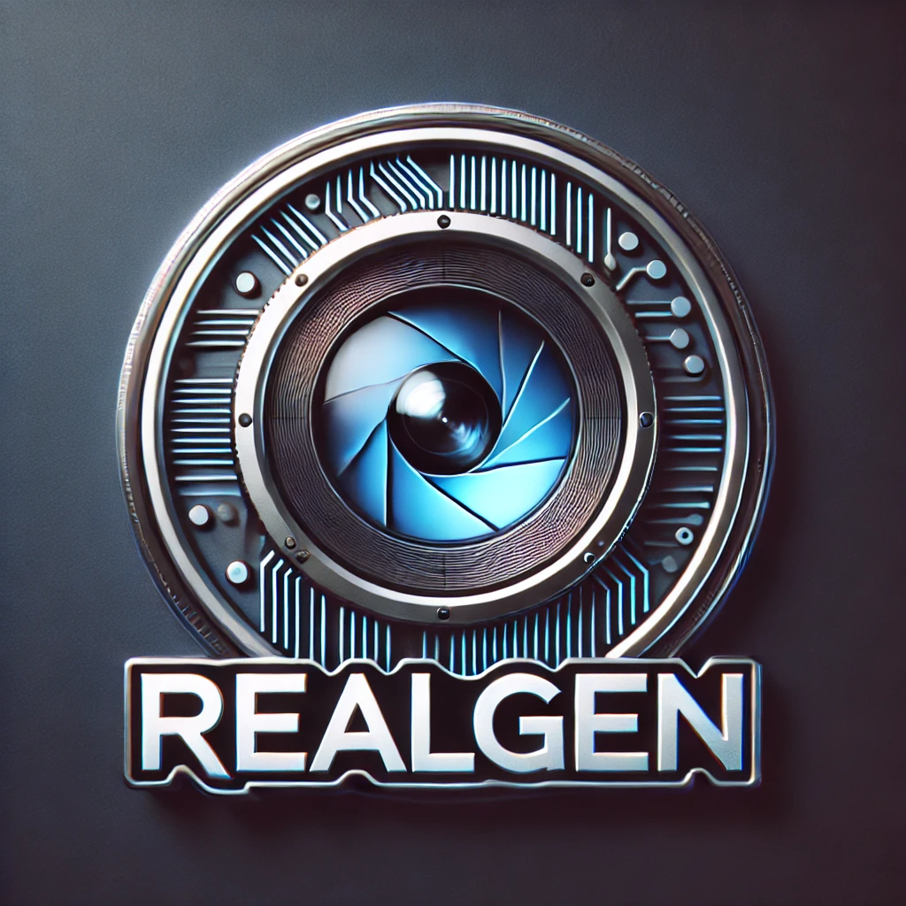
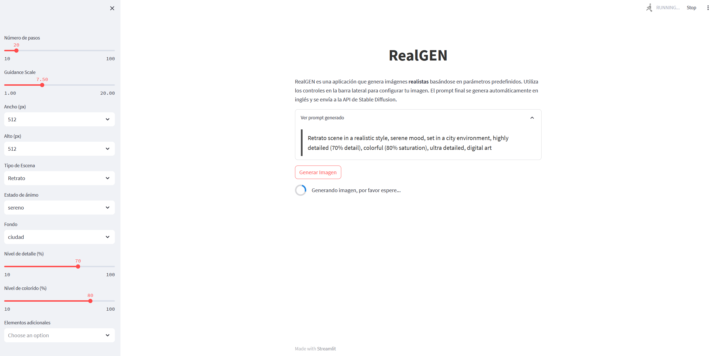
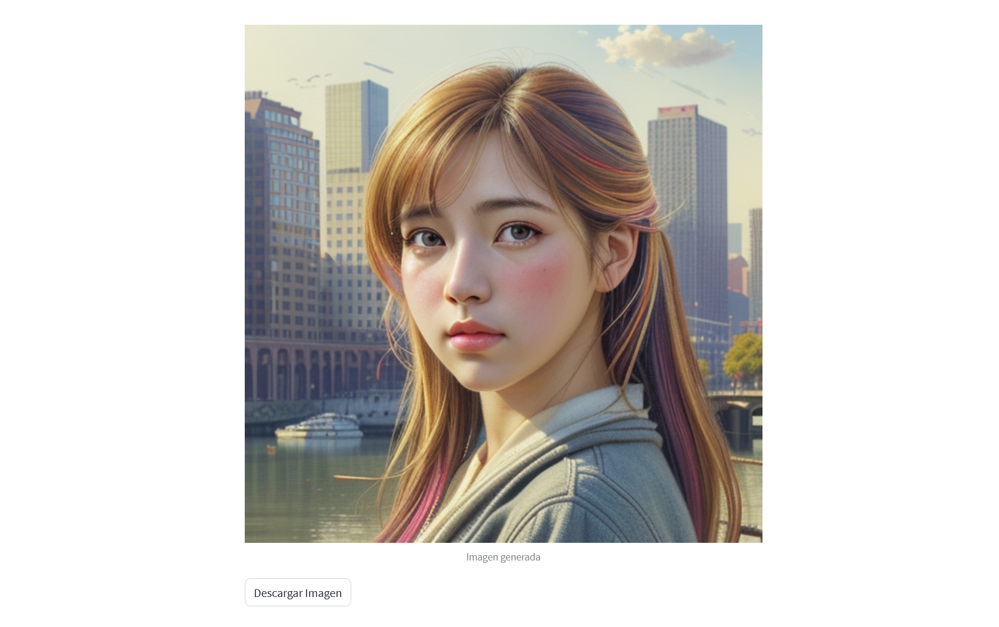
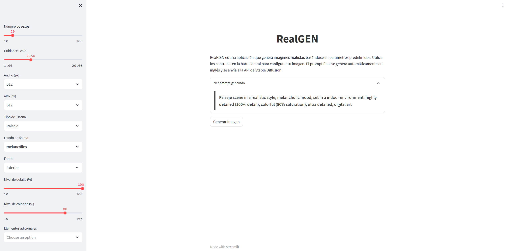
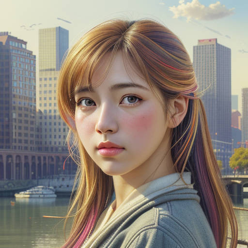
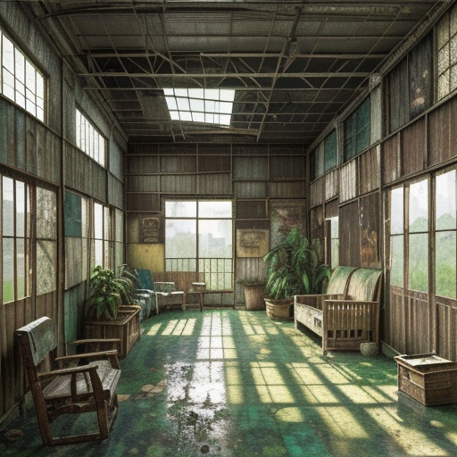
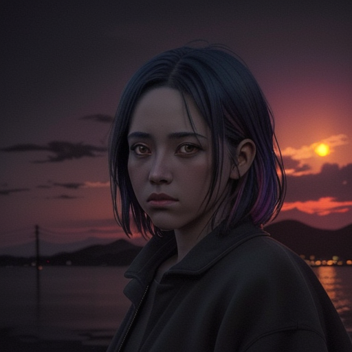
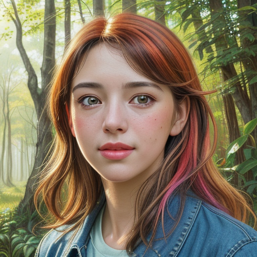

# RealGEN 🎨

RealGEN es una aplicación web que permite generar imágenes **realistas** utilizando la API de Stable Diffusion Web UI. En lugar de escribir un prompt manualmente, puedes configurar todos los parámetros deseados mediante controles interactivos (seleccionables, sliders, etc.). La aplicación construye automáticamente un prompt detallado en inglés y lo envía a la API para generar la imagen.

  

_Proyecto realizado como parte del curso de **Máster de FP en Inteligencia Artificial y Big Data**_ 🎓

---

## 🚀 Acceso y despliegue en vivo

La aplicación web ha sido implementada en un servidor de **HostHatch**, donde se ejecutan tanto la API de Stable Diffusion como la interfaz de **Streamlit**, para así poder probarla en vivo. Para evitar sobrecargas y ataques maliciosos, **se requiere una contraseña** para acceder a la aplicación.

- **Enlace para probar la aplicación en vivo:**  
  [RealGEN](https://realgen.germange.com/)

- **Nota de seguridad:**  
  Para obtener la contraseña de acceso y probar la aplicación, contacta a través de [LinkedIn](https://www.linkedin.com/in/germangarest/).

---

## 👥 Integrantes del equipo

|  |  |
|:---------------------------------------------------------------------------------------------:|:---------------------------------------------------------------------------------------------:|
| **Jairo Andrades Bueno**                                                                      | **Germán García Estévez**                                                                      |

---

## 🏷️ Modelo utilizado

- **Nombre:** Re3mix-realisticV2-Hyper
- **Descripción:**  
  Modelo completo en formato *safetensors*, diseñado para generar imágenes de alta fidelidad y realismo. Captura detalles precisos y ofrece una estética similar a la fotografía, ideal para retratos, paisajes, escenas urbanas o naturales.
- **Enlace:** [Re3mix-realisticV2-Hyper en Civitai](https://civitai.com/models/560176/re3mix-realisticv2-hyper?modelVersionId=623806)

---

## ⚙️ Características de la aplicación

- **Interfaz web interactiva:**  
  Desarrollada en *Streamlit*, RealGEN ofrece una experiencia intuitiva y moderna. La aplicación incorpora un **sistema de control de acceso con contraseña** para evitar accesos no autorizados y proteger los recursos del servidor.

- **Selección de parámetros:**  
  Personaliza tu imagen con:
  - **Tipo de escena:**  
    *(Ej.: Retrato, Paisaje, Urbano, Natural, Nocturno)*
  - **Estado de ánimo:**  
    *(Ej.: sereno, vibrante, melancólico, dinámico, misterioso)*
  - **Fondo o ambientación:**  
    *(Ej.: ciudad, naturaleza, interior, atardecer, amanecer)*
  - **Nivel de detalle (%) y colorido (%):**  
    Ajusta estos parámetros mediante sliders.
  - **Elementos adicionales:**  
    Añade extras como *efectos de luz, composición artística, iluminación dramática, alta resolución, detalles intrincados* mediante un menú multiselección.

- **Generación automática del prompt:**  
  Combina todas tus selecciones para crear un prompt en inglés listo para enviar a la API.

- **Integración con la API de Stable Diffusion:**  
  ¡Solo haz clic en **"Generar Imagen"**! La imagen se muestra en pantalla y puedes descargarla en formato PNG. 📥

---

## 🔧 Funcionamiento y uso

1. **Acceso seguro:**  
   Al ingresar a la aplicación, se solicitará una contraseña. Solo los usuarios autorizados pueden acceder, lo que ayuda a prevenir sobrecargas y ataques maliciosos.

2. **Configuración de parámetros:**  
   Usa la barra lateral para:
   - Elegir el **tipo de escena**, **estado de ánimo** y **fondo** (selectboxes).
   - Ajustar el **nivel de detalle** y **colorido** (sliders).
   - Seleccionar **elementos adicionales** (multiselect).

3. **Visualización del prompt:**  
   Revisa el prompt generado en un contenedor expandible antes de enviarlo.

4. **Generación y descarga de la imagen:**  
   - Pulsa **"generar imagen"** y observa el spinner mientras se procesa tu solicitud.
   - Visualiza la imagen generada y descarga el archivo PNG si lo deseas.

---

## 📸 Capturas de pantalla y ejemplos

### Interfaz de la aplicación

<table>
  <tr>
    <td align="center"></td>
    <td align="center"></td>
  </tr>
  <tr>
    <td colspan="2" align="center"></td>
  </tr>
</table>

### Ejemplos de imágenes generadas y sus parámetros

<table>
  <tr>
    <td align="center">
       
      <strong>Imagen 1</strong> 😊 
      Tipo de escena: **Retrato** 
      Estado de ánimo: **Sereno** 
      Fondo: **Ciudad** 
      70% de detalle 
      80% de colorido
    </td>
    <td align="center">
       
      <strong>Imagen 2</strong> 🌄 
      Tipo de escena: **Paisaje** 
      Estado de ánimo: **Melancólico** 
      Fondo: **Interior** 
      70% de detalle 
      80% de colorido
    </td>
  </tr>
  <tr>
    <td align="center">
       
      <strong>Imagen 3</strong> 🌌 
      Tipo de escena: **Nocturno** 
      Estado de ánimo: **Misterioso** 
      Fondo: **Atardecer** 
      35% de detalle 
      40% de colorido
    </td>
    <td align="center">
       
      <strong>Imagen 4</strong> 🌿 
      Tipo de escena: **Retrato** 
      Estado de ánimo: **Vibrante** 
      Fondo: **Naturaleza** 
      100% de detalle 
      100% de colorido 
      60 pasos (por defecto se usa 20)
    </td>
  </tr>
</table>

Estas imágenes fueron generadas con 20 pasos (excepto la última con 60), y a una resolución de 512x512. Para el despliegue final en el servidor, se limitaron los pasos a 30 (para evitar tiempos de espera excesivos), y se estableció un valor de 5 pasos por defecto, con la misma resolución de 512x512, pues se llegó a la conclusión de que estos eran los mejores parámetros para poder generar una buena imagen sin tener que esperar demasiado (con estos parámetros por defectos el tiempo aprox. de generación es de aprox. 1:30 minutos / 2 minutos.

---

## 📝 Conclusiones

RealGEN simplifica la generación de imágenes realistas con una interfaz intuitiva y controles personalizables. Gracias a la integración con la API de Stable Diffusion y el uso del modelo **Re3mix-realisticV2-Hyper**, se obtienen resultados de alta calidad sin necesidad de conocimientos técnicos avanzados.

¡Ideal para explorar tu creatividad y generar contenido visual impresionante! 🚀
